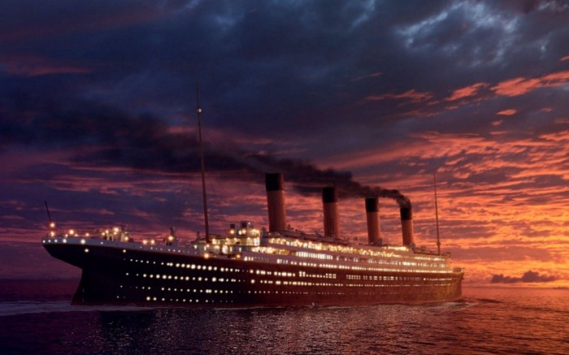

# Analysis and predictions on the most popular kaggle Titanic dataset

### The data has been downloaded from https://www.kaggle.com/c/titanic.



### This is a Jupyter notebook aimed at providing insights of major algorithms used in Data Analysis.


```python
#An iteration of testing all algorithms in a single snippet


algolist = [LogisticRegression(), SVC() , RandomForestClassifier() , KNeighborsClassifier() , GaussianNB() , 
            Perceptron() , DecisionTreeClassifier()]

for algo in algolist :
    algo.fit(X_train, Y_train)
    predictions = algo.predict(X_test)
    accuracy = round(algo.score(X_train , Y_train) * 100 , 2)
    print("The accuracy score using " + str(algo).split('(')[0] + " is " + str(accuracy) + " %")
```

    The accuracy score using LogisticRegression is 80.02 %
    The accuracy score using SVC is 89.23 %
    The accuracy score using RandomForestClassifier is 97.19 %
    The accuracy score using KNeighborsClassifier is 80.58 %
    The accuracy score using GaussianNB is 79.35 %
    The accuracy score using Perceptron is 61.73 %
    The accuracy score using DecisionTreeClassifier is 98.2 %
